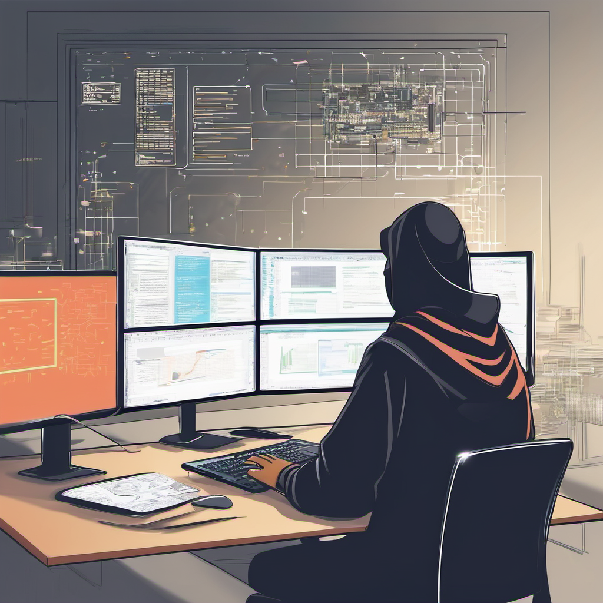

<h1 align= "center" style="color:#06283D;">𝓐𝓫𝓾 𝓗𝓸𝓻𝓪𝓲𝓻𝓪 𝓣𝓪𝓻𝓲𝓯</h1>
<h2 align= "center" style="color:#7B66FF; <strong>Software Engineer/Full Stack Developer</strong></h2>
<h3 align= "center"><em>𝔼𝕩𝕡𝕖𝕣𝕚𝕖𝕟𝕔𝕖𝕕 𝕚𝕟 𝕀𝕋 𝕗𝕚𝕖𝕝𝕕 𝕞𝕠𝕣𝕖 𝕥𝕙𝕒𝕟 𝟟 𝕪𝕖𝕒𝕣𝕤</em></h3>

### Special Thanks to Tapas Da from Bangladesh

### About Me

    During my academic life at CUET, I have gathered several experiences in the field of computer science. 
    I have worked in different branch of Computer Science & Engineering including Software Developement,
    Network Administrator, Web Development, System Design, Android App Development, Game Development etc. 
    I am currently enrolled at BUET in the Department of CSE and conducting research on various branch of IT sectors.

**[My Portfolio Link](https://abuhorairatarif.github.io)**

 **Programming Language :** C, C++, Java, Python, Golang, JavaScript, PHP, C#, Prolog 
 **Database Management:** MySQL, PostgresDB, Microsoft SQL Server, Oracle, Firebase 
 **Framework:** Laravel, Vue.js, Django, Flask, Beego  
 **Web Development:** HTML5, CSS3, JavaScript, Bootstrap, Tailwind, Ajax, jQuery, Wordpress, Node.js  
 **Tools Used:** Matlab, Unity Game Engine, Blender, Cisco Packet Tracer, VMware Workstation, Adobe Photoshop, Adobe Illustrator, Git Bash  
 **Language Proficiency:** Bangla, English, Arabic  
 **Other:** Git, Docker, Android App Development, Game Development, Linux, Figma, Elastic Search, Kibana  

 **Additional SKills:**    
 <ul>
<li>Problem Solving</li>
<li>Critical Thinking</li>
<li>Time Management</li>
<li>Team Work</li>
<li>Attention to detail</li>
</ul>

### Contact Me:

**Github Profile:** (https://abuhorairatarif.github.io)  
**LinkedIn Profile:** (https://www.linkedin.com/in/abu-horaira-tarif-308056132/)
