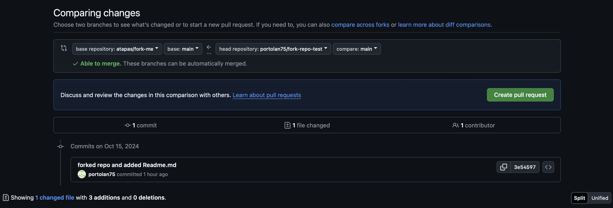

# Forking

In order to fork a repo: (upstream repo name of the example = atapas/fork-me)

1. fork the repo using Github CLI and change its name (from *fork-me* into *fork-repo-test*):  
   `gh repo fork atapas/fork-me --fork-name fork-repo-test`. 
   Optionally (if I'm already in the desired directory I can also clone the directory, so the command will be) 
   `gh repo fork atapas/fork-me --fork-name fork-repo-test --clone=true`

2. make the desired changes to the repo (here i don't create a sub-branch, just making chages directly on the main branch). 
   Here i just: 
   - created the folder *portolan75* `mkdir portolan75`
   - added this *Readme.md* file inside folder *portolan75*.`touch portolan75/Readme.md`
   - add the content in the *Readme.md* file. `open portolan75/Readme.mdRead`
3. add untracked files 
   `git add portolan75/`
4. commit the files and leave a commit message 
   `git commit -m 'forked repo and added Readme.md'`
5. push branch changes to origin (here origin is the name of my remote repository (called origin), whereas branch is the current branch (called main)). 
   `git push origin main`
6. (Optional) open a pull request to propose the modification of the upstream repository (*atapas/fork-me*). 
   In case one feels like pushing to the upstream repo, use the **Pull Requests** tab and choose **New pull request**. 
   It should look like the following.
   
   